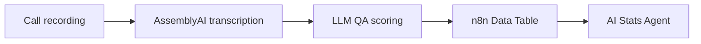

# n8n Call Quality Tracker
> Transcribes support calls, scores quality with AI, answers stats questions via an AI agent.

## Problem
Support teams record hundreds of calls but can review only a few of them.
Quality problems stay invisible until a customer complains.

## Solution
An n8n pipeline transcribes each call with AssemblyAI, scores it against a
QA rubric with an LLM, and stores the result in an n8n Data Table.
A second workflow returns statistics for any date range, and an AI agent
answers managers' questions about team performance in plain language.

## How it works

## Tech stack
n8n | AssemblyAI | OpenAI | n8n Data Tables | AI Agent (stats tool)

## Author
Andrii Shevchuk, AI Automation Engineer | n8n & AI Agents
[LinkedIn](https://www.linkedin.com/in/sh-dev-a-ai/) · [Upwork](https://www.upwork.com/freelancers/~01c28bbcb1e0c08170?mp_source=share) · [Portfolio](https://jasper-spur-64b.notion.site/Andrea-Shevchuk-3746e46a716e80ae90e0f73434dbfb92?source=copy_link)

## License
MIT
